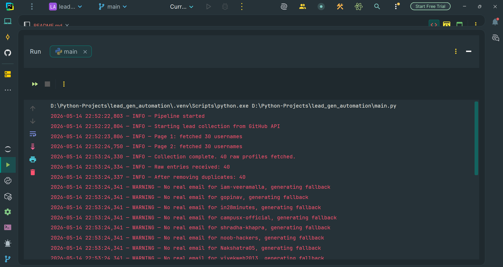
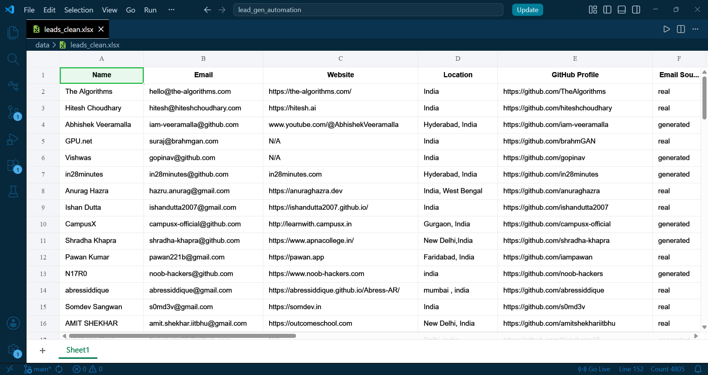

# 🤖 Lead Generation Automation


A Python automation pipeline that collects developer leads from the GitHub Public API, cleans the data, and exports it to Excel — fully automated, one command to run.

---

## 📸 Screenshot



---

## 🔍 What It Does

Hits the GitHub API for Indian developers with 5+ repositories, pulls their profile data, cleans it, generates fallback emails where missing, and saves everything to `data/leads_clean.xlsx` — ready for a sales or outreach team to use directly.

Every run produces a fresh, deduplicated, clean output. No manual steps.

---

## 🗂️ Project Structure

```
lead-gen-automation/
├── pipeline/
│   ├── __init__.py        → exposes collect, clean, export
│   ├── collector.py       → GitHub API calls + profile fetch
│   ├── cleaner.py         → dedup, fill nulls, email generation
│   ├── exporter.py        → writes DataFrame to Excel
│   └── scheduler.py       → runs pipeline every 6 hours
├── data/
│   └── leads_clean.xlsx   → output file (40 leads)
├── .env                   → GitHub token (never pushed)
├── .env.example           → token template for setup
├── .gitignore
├── main.py                → entry point
├── requirements.txt
└── README.md
```

---

## ⚙️ Tech Stack

| Library | Version | Purpose |
|---|---|---|
| requests | 2.31.0 | GitHub API calls |
| pandas | 2.2.2 | Data cleaning and structuring |
| openpyxl | 3.1.2 | Excel file export |
| schedule | 1.2.1 | Automated scheduled runs |
| python-dotenv | 1.0.1 | Load token from .env |

---

## 🚀 Setup

**1. Clone the repo**
```bash
git clone https://github.com/Manglam11/lead_gen_automation.git
cd lead-gen-automation
```

**2. Create and activate virtual environment**
```bash
python -m venv .venv

# Windows
.venv\Scripts\activate

# Mac/Linux
source .venv/bin/activate
```

**3. Install dependencies**
```bash
pip install -r requirements.txt
```

**4. Set up environment file**
```bash
cp .env.example .env
```
Open `.env` and add your GitHub token. Token is optional — the script runs without it, but you get 60 requests/hour unauthenticated vs 5000 with a token.

**5. Run**
```bash
python main.py
```

Output: `data/leads_clean.xlsx`

---

## 📊 Output Format

| Column | Description |
|---|---|
| Name | Developer or organization name |
| Email | Real email or generated fallback |
| Website | Personal site or blog |
| Location | As listed on GitHub profile |
| GitHub Profile | Direct link to their profile |
| Email Source | `real` = from profile, `generated` = auto-generated |

---

## ✨ Bonus Features

**Email Generation**
When a profile has no public email, the script generates a fallback in the format `username@github.com` and tags it as `generated` in the `Email Source` column. Real emails are tagged `real`. The outreach team knows exactly which entries to prioritize.

**Scheduled Automation**
`scheduler.py` runs the full pipeline every 6 hours — no manual trigger needed. Keeps the leads file fresh automatically.

```python
# To start the scheduler instead of a one-time run:
from pipeline.scheduler import start_scheduler
start_scheduler()
```

---

## 🔗 Why GitHub API

Free, open, no scraping risk, and returns structured JSON directly. No CAPTCHA, no IP blocks, and it has all four required fields natively. Fits the assignment perfectly without overcomplicating the data source.

---

## 📄 License


---

## 📬 Contact

[](https://github.com/Manglam11)
[](https://www.linkedin.com/in/manglam-dubey/)
[](https://personal-portfolio-psi-sooty.vercel.app/)

---

> *"The automation of everything is not the death of ambition — it is the redirection of it."*